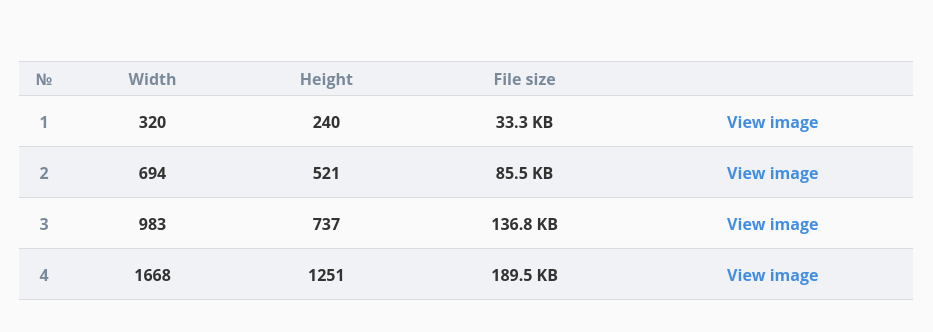
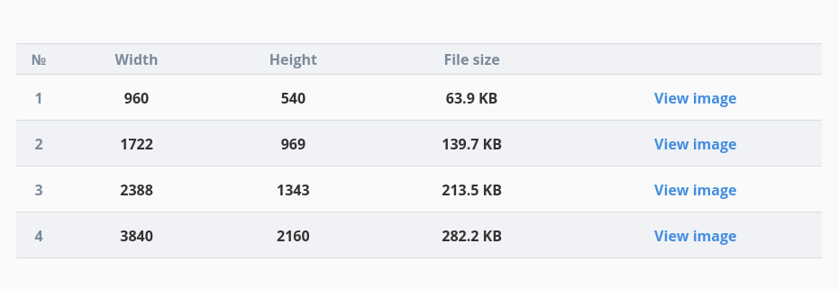

# react-image

Responsive images for React

## Why?

Images are a vast and continuously evolving subject in web development. From capturing screenshots automatically to displaying them responsively without flipping the page on loading — perhaps with placeholders — the list grows.

Just consider the following use case: display screenshots of web pages for design inspiration. The process is:

1. Select the best part of the website to screenshot.
2. Create both portrait and landscape screenshots with large, retina friendly resolution.
3. Resize them to lower resolutions for mobile and tablet displays.
4. Optimize them with compression.
5. Convert them to modern formats like WebP
6. Add images to content responsively with art direction and resolution switching.
7. Display them responsively without flicks during page load using an intrinsic ratio container.
8. Display a progressive placeholder while loading.
9. Make sure tens of images don't slow the page by using a lazy loading technique.
10. Make sure they are served via a CDN for fast delivery.

What if this process could be reduced to:

1. Select the best part of the website to screenshot.
2. Capture both portrait and landscape screenshots with large, retina friendly resolution.
3. Generate optimized responsive images.
4. Add images to content with a single line of code without the need to set up srcset or sizes.
5. Display images

## Capture screenshots (1-2)

With a tool like [screenshooter](https://github.com/vladocar/screenshoteer) you can capture both portrait and landscape screenshots in the command line.

However only the top of the screen is captured. If you want to capture other parts of the page like the footer you'll have to do it manually.

### Aspect ratio

Images are best displayed when they have the same aspect ratio as their host screen: 16:9 on screens in landscape mode and 3/4 in portrait mode.

When capturing screenshots always aim for these aspect ratios.

### Retina

Browser tools lets you capture screenshots larger than your screen size. Go for it and get 2x or 4x images.

### Example:

- Website: https://www.badass35.com/en/home
- Landscape screenshot (4K, 16:9):


- Portrait screenshot (1668x2224, 4:3):


## Generate responsive images and code (3-4)

Use Cloudimage's [Responsive Image Breakpoints Generator](https://www.responsivebreakpoints.com/) to generate all images needed and the associated HTML code. Both `` and `<picture>` code is generated.

### Portrait settings

- Resolution: 320-1024 (from iPhone 5 to iPad Pro 12")
- Size step: 20 (Unchanged)
- Maximum images: 4-6 (mobile small, mobile large, tablet small, tablet large + their retina versions, which might overlap. For example tablet small could be the 2x of mobile small)
- Retina resolution: checked
- Art direction: 4:3 (Tablet)



### Landscape settings

- Resolution: 960-1920 (from tablet in landscape mode to 1k)
- Size step: 20 (Unchanged)
- Maximum images: 4-6 (tablet, laptop, desktop + their retina versions, which might overlap)
- Retina resolution: checked
- Art direction: 16:9 (Small laptops)



### Generated code

- `srcset` is generated well
- `sizes` should be adapted manually to the design

```html

```

## Displaying images (4-5)

### Requirements

1. Built on existing libraries
2. Avoid layout shifts as the image is downloaded
3. Flexible placeholders. It can be an image, a component, a spinner, or anything else
4. Lazy loading
5. SEO friendly

### Libraries

Cloudimage offers a [React library](https://github.com/scaleflex/react-cloudimage-responsive) to display images hosted on their platform. However the costs can [go high](https://www.cloudimage.io/en/pricing), and I found on browser resize sometimes [the images become blurry](http://metamn.io/react-best-practices/?path=/docs/loading-images--art-direction-with-Cloudimage).

On the other hand there are [plenty](https://github.com/stereobooster/react-ideal-image#other-solutions) of standalone React packages to display images.

- [react-image](https://github.com/mbrevda/react-image) - Not responsive but with hooks and Suspense support. Also a pretty young package with lots of issues. Single author.
- [react-worker-image](https://github.com/nitish24p/react-worker-image) - An interesting take. Loading images with web workers to reduce page load speed. Single author.
- [react-ideal-image](https://github.com/stereobooster/react-ideal-image) - 3.2k Github stars, not actively maintained. Multiple authors.
- [react-progressive-image](https://github.com/FormidableLabs/react-progressive-image) - Already [tried and tested](https://github.com/metamn/inu-v2-b/blob/master/react-src/src/components/ImageResponsive/ImageResponsive.js) in production on http://inu.ro. Backed by Formidable.

### Layout shifts

By default responsive images (`` and `<picture>`) do a layout shift after the image is downloaded and it is displayed. Reasons vary but mostly: you can't set the `width` and `height` of the images inside the `srcset` attribute.

Example:

```html

```

On tablet initially the `beat-home-mobile_desktop.png` of 622px width is loaded since it's in the `src` attribute.
Later it will be replaced by `home-mobile_tablet.png` which is 535px wide. This causes a flick.

To solve the problem the aspect ratio of the image has to be set. Read more about this current best practice (March 2020) [here](https://www.smashingmagazine.com/2020/03/setting-height-width-images-important-again/).

There is another workaround like setting image dimensions in CSS for every breakpoint. A working example can be found [here](https://github.com/metamn/inu-v2-b/blob/master/react-src/src/components/ImageResponsive/ImageResponsive.js)

### SEO

When content is data (not markup) many representations of the content can be generated. Be that HTML, JSON-LD or anything else. For browsers, bots and humans with disabilities.

With React the recipe would be:

1. For data: Entries in `propTypes` should contain entries from https://schema.org/image (like name, url, width, height from https://schema.org/ImageObject)
2. For generator: After the HTML representation (``) also the JSON-LD or OpenGraph representation should be added perhaps with a plugin like https://github.com/garmeeh/next-seo

Example:

```js
/**
 * Import generators
 */
import { ImageJsonLd } from 'next-seo'; // Schema.org, JSON-LD
import { NextSeo } from 'next-seo'; // OpenGraph

/**
 * Reuse schema.org definitions
 */
const propTypes = {
  /**
   * From https://schema.org/ImageObject
   */
  name: PropType.string,
  url: PropTypes.string,
  width: PropTypes.number,
  height: PropTypes.number
};

const defaultProps = {....}
const props = ApiCall(...) || defaultProps

...

return (
	<>
		
		{/* When props are in sync with Schema.org the generators should work in this simple way */}
		<ImageJsonLd {...props}/>
		<NextSeo openGraph={{...props}}/>
	</>
)
```

### Accessibility

A11y is an [ample chapter in React](https://reactjs.org/docs/accessibility.html). WAI ARIA props (`aria-*`) are fully supported, and, connected with testing. The [`ByRole` query](https://testing-library.com/docs/dom-testing-library/cheatsheet#queries) in React Testing Library can be used in writing tests.

Images have no [WAI ARIA best practices](https://testing-library.com/docs/dom-testing-library/cheatsheet#queries). However we will use [`role="img"`](https://developer.mozilla.org/en-US/docs/Web/Accessibility/ARIA/Roles/Role_Img) and test it with `ByRole`

## Resources

- [Responsive Images the Simple Way](https://cloudfour.com/thinks/responsive-images-the-simple-way/)
- [An Almost Ideal React Image Component](https://github.com/stereobooster/react-ideal-image)
- [Setting Height And Width On Images Is Important Again](https://www.smashingmagazine.com/2020/03/setting-height-width-images-important-again/)
